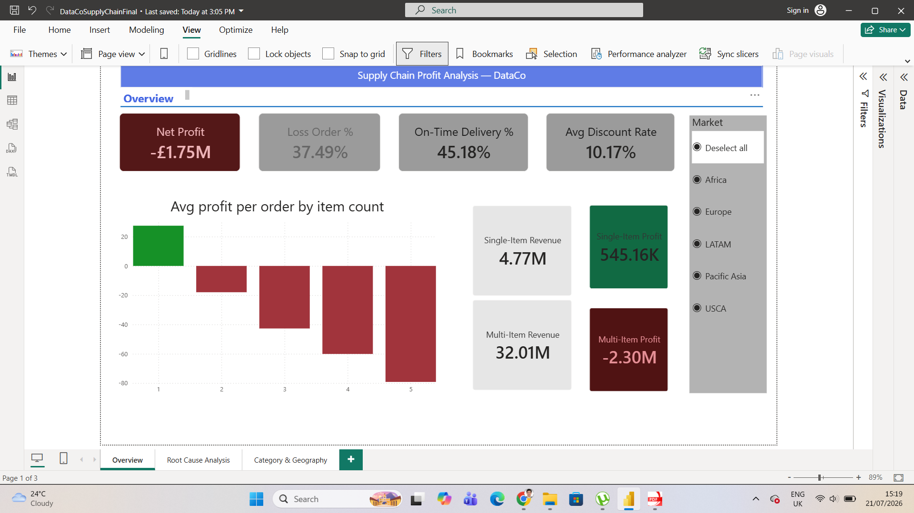
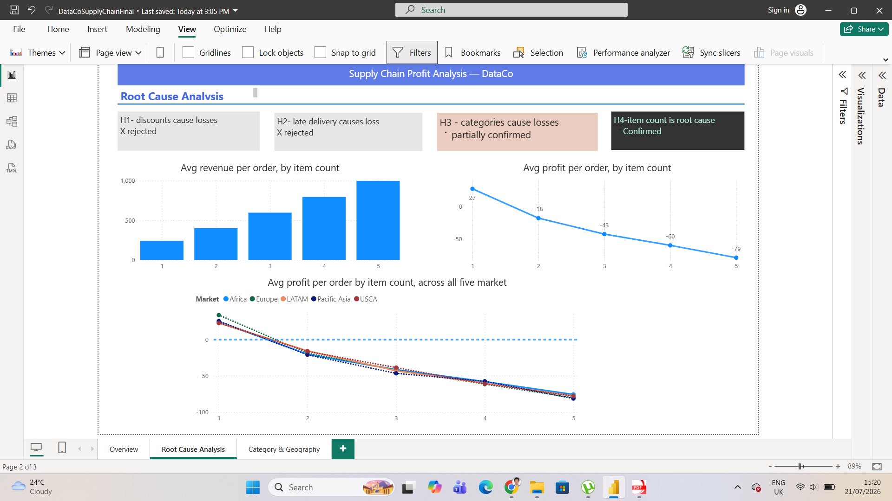
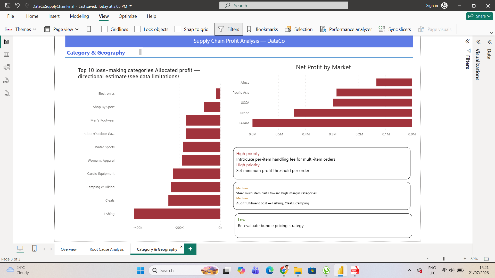

# 📦 Diagnosing £1.75M in Losses: Supply Chain Profit Analysis with SQL and Power BI

**A Business Intelligence & Data Analysis Portfolio Project**

---

## 🧭 Project Overview

This project analyses transactional sales data from **DataCo**, a fictional international retail chain, to diagnose the root causes of structural profit erosion across its global markets.

Using SQL-first analysis, I conducted a full data audit, built analytical views, tested business hypotheses, and delivered data-driven recommendations — mimicking the workflow of a real data analyst role.

> **Core Finding:** 87% of DataCo's revenue comes from multi-item orders — yet every single one of them loses money on average. This is not a regional issue. It is a structural flaw in the company's order economics.

---

## 🗂️ Dataset

| Attribute | Value |
|-----------|-------|
| Source | DataCo Supply Chain Dataset (Kaggle) |
| Rows | 180,519 (order-item level) |
| Distinct Orders | 65,752 |
| Markets | Africa, Europe, LATAM, Pacific Asia, USCA |
| Key Fields | Sales, Profit, Discount, Shipping, Customer, Product, Category |

---

## ❓ Business Problem

> *"DataCo aims to improve profitability and supply chain efficiency across its global markets. Initial observations indicate negative-profit orders, delivery delays, and performance inconsistencies across regions. This project analyses transactional, customer, and shipping data to identify the root causes of profit leakage and operational inefficiencies, and to provide data-driven recommendations for performance optimisation."*

---

## 📐 KPIs Tracked

| KPI | Result |
|-----|--------|
| % of loss-making orders | **37.5%** |
| Overall net profit | **−£1.75M** |
| On-time delivery rate | **45.2%** |
| Average shipping delay | **+0.57 days** |
| Average discount rate | **10.2%** |
| Multi-item order avg profit | **−£50.00** |
| Single-item order avg profit | **+£27.46** |

---

## 🔍 Analysis Approach

The raw dataset is at **order-item level**. To avoid double-counting profit (which repeats per item), I restructured the data into three analytical layers:

```
Raw Data (order-item level)
       │
       ├── v_order      → Order-level KPIs (profit, delay, item count)
       ├── v_product    → Product/category sales and discount analysis
       └── v_customer   → Customer purchase frequency and revenue
```

---

## 🧪 Hypothesis Testing

| Hypothesis | Tested Via | Result |
|------------|-----------|--------|
| Discounts cause losses | Avg discount: Loss vs Profit orders | ❌ Rejected — difference < 0.1% |
| Late delivery causes losses | Late rate: Multi vs Single orders | ❌ Rejected — virtually identical |
| Certain categories are loss-making | Allocated profit by category | ✅ Confirmed (Fishing, Cleats, Camping) |
| Multi-item orders are structurally unprofitable | Avg profit by item count | ✅ Confirmed — linear decline |
| Problem is regional | Market × item count analysis | ❌ Rejected — pattern universal |

---

## 📊 Key Findings

### Finding 1 — Multi-Item Orders Are Structurally Loss-Making

| Items per Order | Avg Profit (£) | Orders |
|-----------------|---------------|--------|
| 1 | +27.46 | 19,850 |
| 2 | −17.97 | 11,447 |
| 3 | −42.71 | 11,398 |
| 4 | −60.11 | 11,704 |
| 5 | −79.21 | 11,353 |

**Each additional item reduces order profit by ~£20–22.** This relationship is nearly perfectly linear, suggesting a cost that scales with item count but is not captured in per-item pricing.

### Finding 2 — Multi Orders Drive Revenue but Destroy Profit

| Order Type | Orders | Revenue | Profit |
|------------|--------|---------|--------|
| Multi-item | 45,902 (70%) | £32.0M (87%) | **−£2.3M** |
| Single-item | 19,850 (30%) | £4.7M (13%) | **+£545K** |

The company's entire profit base rests on 13% of its revenue. Multi-item orders are eroding it.

### Finding 3 — Pattern Repeats Across All Markets

Every market shows the same declining profit curve as item count increases. This rules out a regional or operational anomaly — the issue is embedded in the business model.

### Finding 4 — Loss Is Not Driven by Discount or Late Delivery

Average discount rates and late delivery rates are statistically identical between profitable and loss-making orders. The problem lies in unmodelled cost — most likely **per-item fulfilment cost** (picking, packing, handling) that is not factored into pricing.

---

## 📊 Power BI Dashboard

A three-page interactive dashboard built in Power BI Desktop, connected to a clean star schema model (Fact_Orders, Fact_Items, Dim_Date, Dim_Customer, Dim_Market, Dim_Product).

### Page 1 — Executive Overview


### Page 2 — Root Cause Analysis


### Page 3 — Category & Geography Detail


---

## ⚠️ Data Limitations

Category and department labels show inconsistencies for some products in the source dataset — for example, golf equipment appearing under Women's Apparel. Category-level findings should be interpreted as directional rather than precise. All order-level findings (profit by item count, market-level analysis) are unaffected by this issue.

---

## 💡 Recommendations

| Priority | Recommendation | Rationale |
|----------|---------------|-----------|
| 🔴 High | Introduce a minimum profit threshold per order | Prevent orders from being accepted below break-even |
| 🔴 High | Apply a per-item handling fee for multi-item orders | Recover fulfilment cost currently absorbed as loss |
| 🟡 Medium | Steer multi-item carts toward high-margin categories | Reduce structural losses without reducing order volume |
| 🟡 Medium | Audit fulfilment cost per SKU (especially Fishing, Cleats, Camping) | Identify categories where unit economics are broken |
| 🟢 Low | Re-evaluate bundle pricing strategy | Bundles should be priced to cover collective fulfilment cost |

---

## 🗃️ Repository Structure

```
DataCo_MultiOrder_Analysis/
│
├── README.md
│
├── sql/
│   ├── 01_data_audit.sql             # Initial data validation queries
│   ├── 02_create_views.sql           # Build v_order, v_product, v_customer
│   ├── 03_kpi_analysis.sql           # Core KPI calculations
│   ├── 04_hypothesis_testing.sql     # Discount, delivery, category tests
│   └── 05_multi_order_deep_dive.sql  # Root cause analysis
│
├── screenshots/
│   ├── page1_overview.png            # Executive overview dashboard
│   ├── page2_root_cause.png          # Root cause analysis dashboard
│   └── page3_category_geography.png  # Category and geography detail
│
├── docs/
│   └── STAR_CaseStudy.md             # Full STAR case study for interviews
│
└── analysis/
    └── KPI_Summary.md                # Final numbers reference sheet
├── docs/
│   ├── STAR_CaseStudy.md
│   └── DataCo_Profit_Analysis.docx   # Full written analysis report
```

---

## 🛠️ Tools Used

- **SQL** (SQLite) — data audit, view creation, KPI analysis, hypothesis testing
- **Power BI Desktop** — star schema model, DAX measures, 3-page interactive dashboard
- **GitHub** — version control and portfolio presentation

---

## 👤 Author

**Ahmad Zia Bahrami**  
MSc Data Science and Engineering — University of Dundee  
Milton Keynes, UK  
[LinkedIn](https://www.linkedin.com/in/ahmad-zia-bahrami-32540058/) | [GitHub](https://github.com/Bahrami87)

---

*This project uses a publicly available dataset. DataCo is a fictional company used for analytical practice.*
